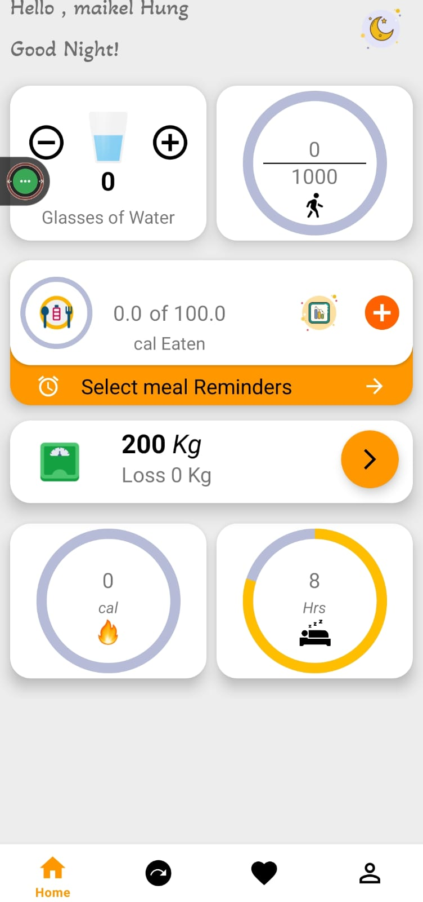

# 🩺 LifeBalance — Health & Lifestyle App

Android application that helps users maintain a healthy lifestyle by tracking daily health habits in one integrated platform.

---

## 📱 Screenshots

  
  &nbsp;&nbsp;
  
  &nbsp;&nbsp;

---

## ✨ Features

- **Step Counter** — tracks daily steps using device hardware sensor
- **Water Tracker** — logs daily water intake with reminders
- **Weight Tracker** — records body weight and calculates BMI
- **Meal Logging** — logs food consumption with calorie & nutrient breakdown (fat, protein, carbs, sugar)
- **Health Statistics** — monitors blood pressure, blood sugar, and cholesterol via line charts
- **Reminder System** — scheduled notifications for water, meals, and medicine via WorkManager

---

## 🏗️ Tech Stack

| Layer | Technology |
|---|---|
| Language | Kotlin |
| Architecture | MVVM + Repository Pattern |
| Cloud Database | Firebase Firestore |
| Local Database | Room DB (offline support) |
| Auth | Firebase Authentication |
| DI | Dagger Hilt |
| Background Tasks | WorkManager + AlarmManager |
| Location | Fused Location Provider |

---

## 👥 Team

| Name | Role |
|---|---|
| Evan Yo | UI/UX Design |
| Theon Anabel Deadora | Developer & Database Integration |
| Raihan Maulidar | Logic & Testing |
| Muhammad Thomas Pangukir | Documentation & Deployment |

---

## 📄 License

Developed for educational purposes as a final project for Mobile Application Programming course at Universitas Multimedia Nusantara (UMN), 2025.
